# 基于 OCR + RAG 的文档智能问答系统（AX650N）

<div align="center">

**端到端文档识别与检索问答 | 边缘 AI 部署 | 隐私友好**


</div>


基于 **PaddleOCR-VL** + **Qwen3-Embedding** + **Qwen3** + **LangChain RAG** 的文档智能问答系统，支持 PDF、扫描件及常见图片格式的端到端识别与检索问答。专为 **AX650N 边缘 AI 芯片**优化，可在嵌入式设备上实现完整的文档数字化与智能检索能力。

---

## 目录

- [项目背景](#项目背景)
- [应用场景](#应用场景)
- [核心特性](#核心特性)
- [系统架构](#系统架构)
- [快速开始](#快速开始)
- [使用方式](#使用方式)
- [案例演示](#案例演示)
- [硬件资源使用](#硬件资源使用)
- [常见问题](#常见问题)


---

## 项目背景

### 为什么需要边缘端 OCR + RAG？

在日常办公和业务场景中，大量关键信息沉淀在 PDF 文档、扫描件和图片中——合同条款、药品说明书、技术手册、发票凭证等。传统的文档处理方式面临三大痛点：

1. **信息检索低效** — 依靠人工翻阅或关键词搜索，难以快速定位到精确答案，尤其在数百页的技术手册或法律文件中。
2. **隐私合规风险** — 将敏感文档上传至云端 AI 服务存在数据泄露隐患，医疗、金融、政务等领域对数据本地化有严格要求。
3. **云端依赖与成本** — 公有云 OCR/LLM 服务按量计费，大批量处理成本高昂，且网络延迟影响实时交互体验。

### 本项目的解决思路

本项目将 OCR 文字识别、向量检索与大语言模型理解三大能力整合到单一流水线中，完整运行在 **AX650N 边缘 AI 芯片**上，实现：

- 🔒 **数据不出设备** — 文档解析、向量化、推理全流程本地运行，杜绝隐私泄露风险。
- ⚡ **低延迟交互** — 无需网络往返，端到端延迟控制在秒级，支持实时问答对话。
- 💰 **零调用成本** — 一次硬件投入，无限次使用，适合批量文档持续处理。
- 🧠 **语义级理解** — 区别于关键词匹配，RAG 能理解问题语义并从文档中检索最相关的片段作答。

### 技术路线选型

| 环节 | 选型 | 考量 |
|------|------|------|
| OCR 识别 | PaddleOCR-VL-0.9B | 端到端视觉语言模型，OmniDocBench 94.5% 精度，支持版面分析 |
| 文本嵌入 | Qwen3-Embedding-0.6B | 轻量级高性价比嵌入模型，中文语义理解优秀 |
| 大语言模型 | Qwen3-1.7B | 小参数量但推理能力扎实，适合边缘设备部署 |
| RAG 框架 | LangChain | 成熟生态，LCEL 链式编排，多向量数据库支持 |
| 硬件平台 | AX650N | 高能效比 NPU，单芯片承载 OCR + Embedding + LLM 三路推理 |

---

## 应用场景

### 🏥 医疗健康
- **药品说明书问答** — 拍摄药盒或扫描说明书，直接询问「布洛芬的每日最大用量」「禁忌人群」等，系统从说明书中检索并回答。
- **病历/检验报告检索** — 多份检查报告批量入库，按病症、指标名快速检索相关历史记录。
- **医学文献辅助阅读** — 对 PDF 论文进行 OCR 后，支持跨文档检索实验方法、结论等。

### ⚖️ 法律与合规
- **合同条款检索** — 上传合同 PDF，快速定位违约责任、管辖条款、保密义务等关键内容。
- **法规条文问答** — 将法律法规 PDF 入库，通过自然语言查询适用的法条与具体规定。
- **审计底稿检索** — 批量处理审计工作底稿，按科目、事项描述检索相关内容。

### 🏭 工业与制造
- **技术手册查询** — 设备操作手册、维修指南 PDF 入库后，工程师可语音/文字提问，快速获取故障排查步骤。
- **图纸标注识别** — 对工程图纸进行 OCR，提取标注文字并支持检索。
- **SOP 文件管理** — 标准化作业程序文件数字化，新员工通过问答快速了解操作规范。

### 🏛️ 政务与档案
- **档案数字化检索** — 扫描的历史档案、证件、批文经 OCR 后入库，支持按人名、日期、事由等自然语言检索。
- **政策文件问答** — 政府发布的政策文件 PDF 入库后，公众或工作人员可直接提问获取具体条款。

### 🎓 教育与科研
- **课件/教材检索** — 将课程 PDF 教材入库，学生可针对知识点提问，系统定位到相关章节并回答。
- **论文文献管理** — 批量导入论文 PDF，按研究方向、方法、结论等维度跨文献检索。
- **考试资料整理** — 扫描的试卷、笔记经 OCR 后入库，按知识点分类检索。

### 🏢 企业日常
- **发票与凭证处理** — 批量识别发票、报销单中的关键信息，支持按金额、日期、抬头检索。
- **内部文档知识库** — 将公司制度、流程说明、FAQ 等文档入库，构建企业私有知识问答系统。
- **简历筛选** — 批量解析简历 PDF/图片，按技能、经验年限等条件检索匹配候选人。

---

## 核心特性

### 🚀 功能特性

- **多格式支持** — 覆盖 PDF（文字型/扫描版）、PNG、JPG、BMP、TIF 等主流文档与图片格式。
- **端到端流水线** — 上传即用：文档 → OCR 识别 → Markdown 清洗 → 智能分割 → 向量嵌入 → RAG 问答，全自动完成。
- **多轮对话** — 支持带上下文的连续问答，系统记忆对话历史，追问无需重复描述。
- **流式输出** — LLM 回答以 token 级流式返回，提升交互响应感。
- **来源追溯** — 每个回答附带来源引用（文档名、页码、原文片段），可追溯可验证。
- **Web UI** — 基于 FastAPI 的现代化界面，支持上传、预览、OCR 查看、问答一站式操作。
- **Python API** — 提供完整的编程接口，可嵌入到自动化流程或第三方系统中。
- **CLI 工具** — 命令行一键 OCR 识别或问答，适合脚本批处理和远程操作。

### 🔧 技术特性

- **模块化解耦** — OCR 加载器、文本处理器、向量存储、RAG 链各自独立，可单独替换或升级任一环节。
- **多向量数据库** — 支持 ChromaDB（默认）和 FAISS，可按场景灵活切换。
- **多检索策略** — 支持相似度检索、MMR（最大边际相关性）检索、带分数检索三种模式。
- **OpenAI 兼容 API** — LLM、Embedding、OCR 均通过 OpenAI 兼容接口调用，可对接 vLLM、llama.cpp 等任意兼容服务。
- **递归文本分割** — 基于语义边界的中文优化分割器，支持自定义分隔符、块大小与重叠度。
- **即时配置热更新** — Web UI 内修改 API 地址、模型参数等配置，即时生效无需重启。

---

## 系统架构

### 整体架构

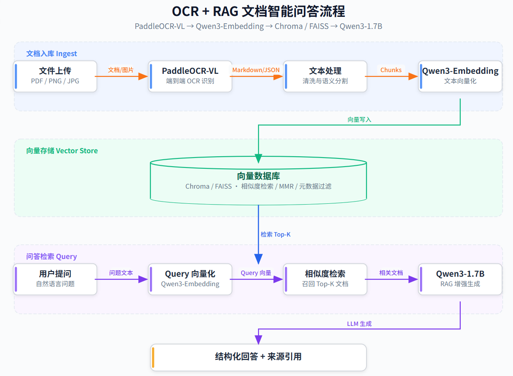

### 数据流详解

1. **文档上传** — 用户通过 Web UI、API 或 CLI 提交文档（PDF/图片），文件保存至 `data/uploads/`。
2. **OCR 识别** — PaddleOCR-VL 对文档逐页进行端到端文字识别，支持版面分析、表格识别、公式识别，输出 Markdown 格式文本。
3. **文本清洗与分割** — 清洗 OCR 噪声（多余空格、断行修复），基于中文语义边界递归分割为 800 字符（可配置）的文本块，相邻块间保留 150 字符重叠。
4. **向量嵌入** — Qwen3-Embedding 将每个文本块编码为 1024 维向量，写入 ChromaDB / FAISS 向量数据库。
5. **用户提问** — 用户输入自然语言问题，系统将问题向量化后在数据库中进行语义相似度检索，返回 Top-K 相关文本块。
6. **RAG 生成** — 检索到的上下文与问题拼接后送入 Qwen3 LLM，生成基于文档内容的精准回答，同时标注引用来源。


### 模型栈

| 模型类型 | 模型名称 | 说明 |
|---------|---------|------|
| **OCR** | [PaddleOCR-VL-0.9B](https://huggingface.co/AXERA-TECH/PaddleOCR-VL-1.5) |  OCR 识别 |
| **LLM** | [Qwen3-1.7B](https://huggingface.co/AXERA-TECH/Qwen3-1.7B-GPTQ-Int4) | 大语言模型 |
| **Embedding** | [Qwen3-Embedding-0.6B](https://huggingface.co/AXERA-TECH/Qwen3-Embedding-0.6B) | 文本嵌入模型 |

### 支持格式

- PDF（文字型 / 扫描版）
- PNG / JPG / JPEG / BMP / TIF / TIFF

### 文件架构

```
OCR_RAG/
├── requirements.txt      # Python 依赖
├── .env.example          # 环境变量模板
├── config.py             # 全局配置中心
├── ocr_loader.py         # PaddleOCR-VL 加载器 (支持多格式)
├── text_processor.py     # Markdown 清洗 + 智能分割
├── embeddings.py         # Qwen3-Embedding 向量嵌入
├── vector_store.py       # 向量数据库管理 (Chroma/FAISS)
├── rag_chain.py          # RAG 问答链 (Qwen3)
├── app.py                # Web UI
└── data/                 # 运行时数据
    ├── uploads/
    ├── ocr_output/
    ├── vector_db/
    └── logs/
```
---

## 快速开始

### 1. 环境准备

```bash
pip install -r requirements.txt
```

### 2. 配置环境变量

OCR、LLM、Embedding 均通过环境变量配置，兼容 OpenAI API 格式。

```bash
cp .env.example .env
# 编辑 .env 文件，填入实际模型路径和 API 地址
```

`.env` 配置示例：

```ini
# LLM API（OpenAI API 格式）
LLM_API_KEY=not-needed
LLM_API_BASE=http://127.0.0.1:8013/v1
LLM_MODEL_NAME=AXERA-TECH/Qwen3-1.7B-GPTQ-Int4
LLM_TEMPERATURE=0.1
LLM_MAX_TOKENS=2048

# Embedding API
EMBEDDING_MODEL_NAME=AXERA-TECH/Qwen3-Embedding-0.6B
EMBEDDING_API_BASE=http://127.0.0.1:8014/v1
EMBEDDING_API_KEY=not-needed
EMBEDDING_BATCH_SIZE=4

# OCR API
OCR_ENGINE=api
OCR_API_BASE=http://127.0.0.1:8015/v1
OCR_API_MODEL=AXERA-TECH/PaddleOCR-VL-1.5
OCR_API_KEY=not-needed
OCR_TASK=ocr
```

### 3. 启动模型服务

基于 AX650N 芯片启动各模型服务：

```bash
# LLM 服务 — 端口 8013
axllm serve /root/huangjie/AXERA-TECH/models--AXERA-TECH--Qwen3-1.7B --port 8013

# Embedding 服务 — 端口 8014
axllm serve /root/huangjie/AXERA-TECH/models--AXERA-TECH--Qwen3-Embedding-0.6B --port 8014

# OCR 服务 — 端口 8015
axllm serve /root/huangjie/AXERA-TECH/PaddleOCR-VL-1.5 --port 8015
```

## 使用方式

### 1. Web UI（推荐）

```bash
python app.py
```

浏览器访问 **http://localhost:7860**

**问答界面**

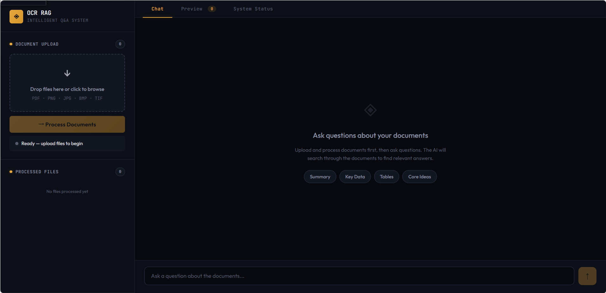

**预览界面**

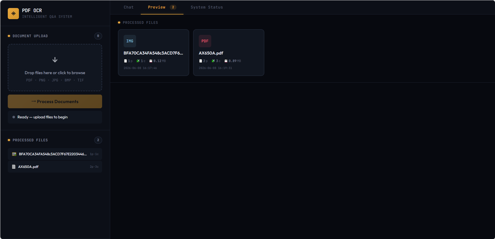

**设置界面**

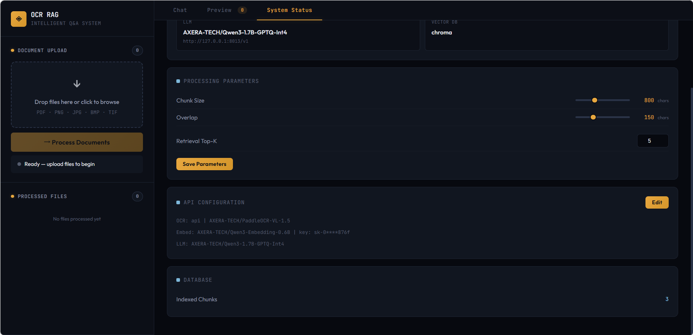

### 2. Python API

```python
from rag_chain import PDFRAGPipeline

# 初始化流水线
pipeline = PDFRAGPipeline()

# 处理文档 (支持 PDF/PNG/JPG/BMP/TIF)
pipeline.ingest("document.pdf")
pipeline.ingest("scan.png")

# 问答
result = pipeline.ask("文档主要内容是什么?")
print(result["answer"])
print(result["sources"])

# 多轮对话
result = pipeline.ask_with_history(
    "那第二章呢?",
    chat_history=[
        {"role": "user", "content": "文档主要讲什么?"},
        {"role": "assistant", "content": "文档主要介绍了..."},
    ]
)

# 流式输出
for chunk in pipeline.ask_stream("请总结文档"):
    print(chunk, end="", flush=True)
```

### 3. 命令行

```bash
# 直接对文件提问
python rag_chain.py document.pdf "文档主要内容是什么?"

# OCR 识别并输出 Markdown
python ocr_loader.py scan.png --md

# OCR 识别并输出 JSON
python ocr_loader.py document.pdf --json
```

### 4. 分步使用

```python
from ocr_loader import PaddleOCRLoader
from text_processor import TextProcessingPipeline
from vector_store import build_vector_store
from rag_chain import RAGChain

# 1. OCR
loader = PaddleOCRLoader("document.pdf", dpi=300)
documents = loader.load()

# 2. 文本处理
pipeline = TextProcessingPipeline(chunk_size=800, chunk_overlap=150)
chunks = pipeline.process(documents)

# 3. 向量化
manager = build_vector_store(chunks)

# 4. 问答
chain = RAGChain(vector_store_manager=manager)
result = chain.query("文档主要内容?")
```

---

## 案例演示

### 演示视频

[](https://github.com/AXERA-TECH/OCR_RAG-AX650N/blob/main/assets/OCR_RAG2.mp4)

> 👆 点击上方图片跳转播放视频

### 使用步骤

**1. 在 AX650N 芯片上启动模型服务**

LLM 服务

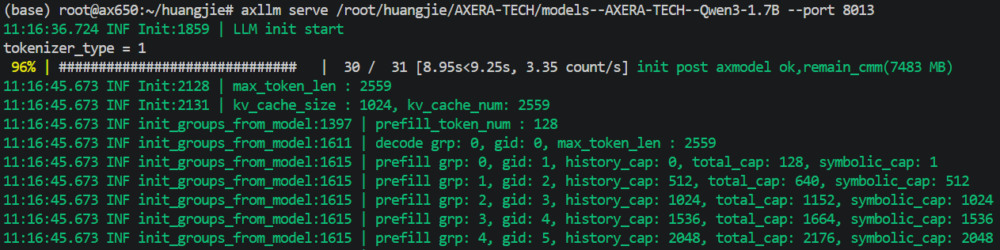

Embedding 服务

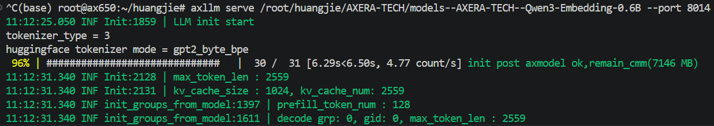

OCR 服务

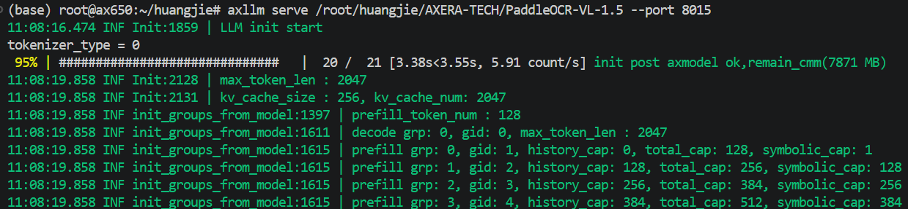

运行UI

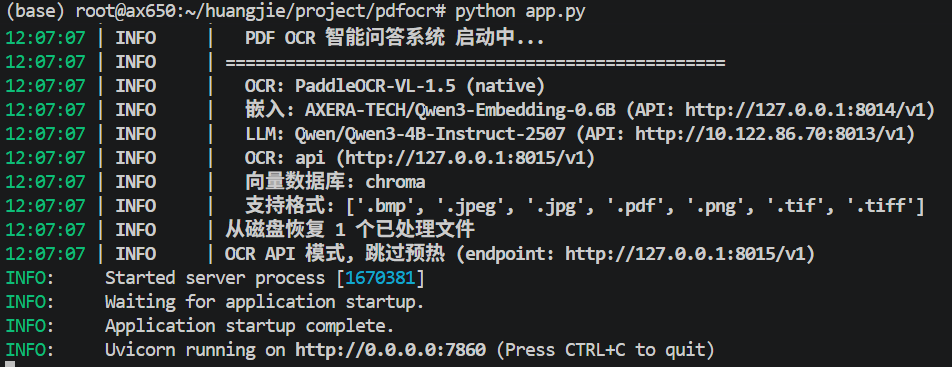

**2. 上传原始文件**

支持 PDF / PNG / JPG / BMP / TIF


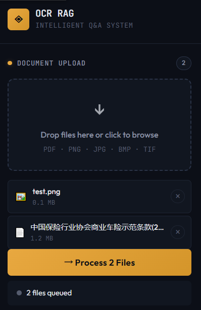

**3. OCR 识别**

OCR 识别并输出文本，支持原始文件和 OCR 结果同时查看：


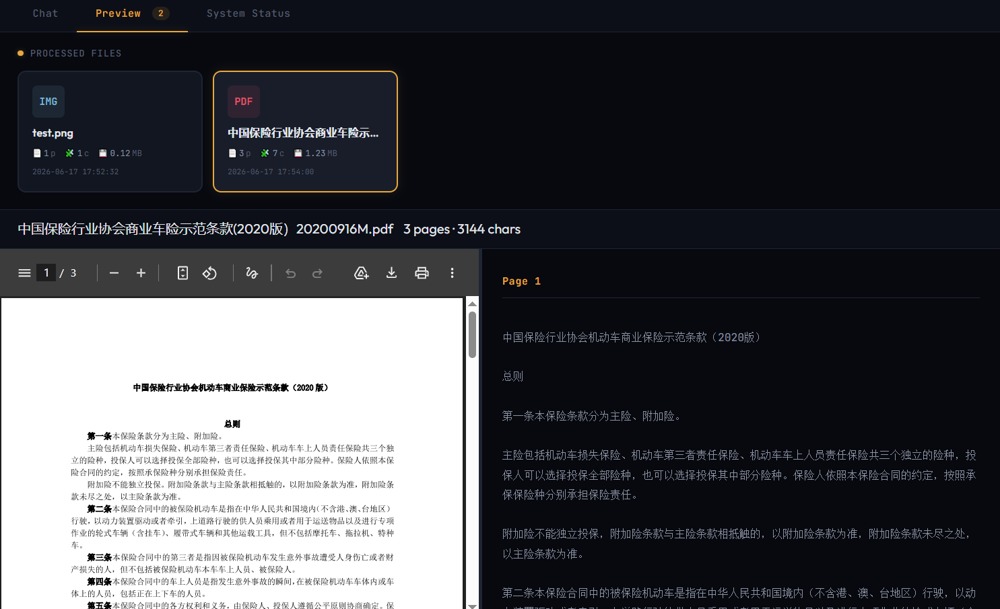


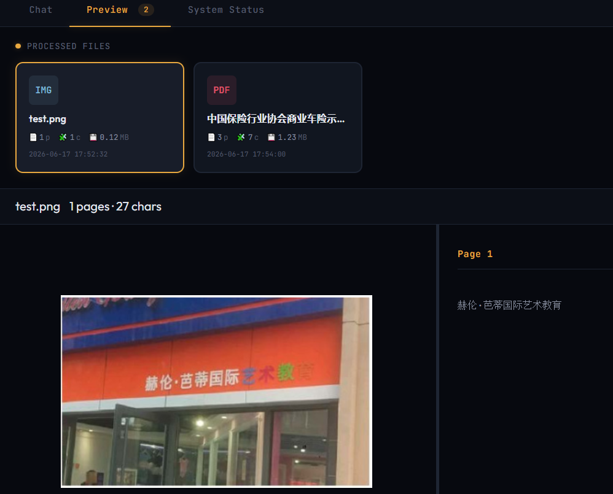

**4. 智能问答**

根据输入内容检索相关文本片段并返回结果。

例如提问「机动车损失赔款计算方法」，系统在知识库中正确检索到相关的文本片段，并依据该文本进行回答。

AI回答内容：
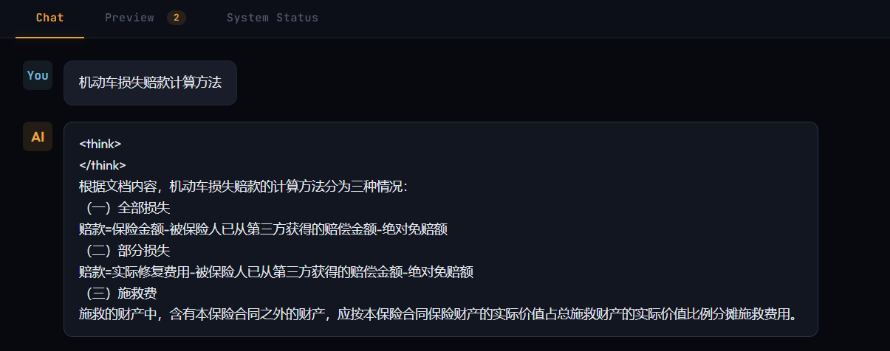

PDF原始文档内容：

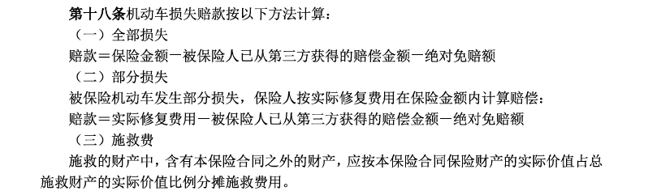

## 硬件资源使用

基于 AX650N 平台运行本项目时，内存（CMM）、Flash 占用情况如下：

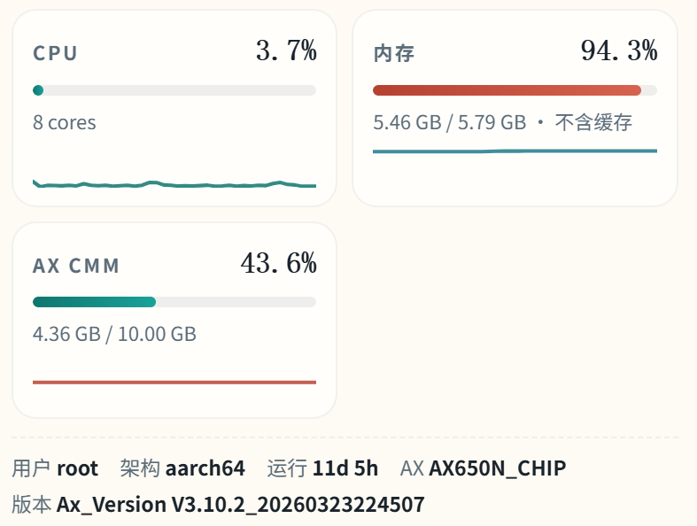

| 资源类型 | 占用情况 | 说明 |
|---------|---------|------|
| CMM 内存 | 约 4.36 GB | 三模型（OCR + Embedding + LLM）同时加载 |
| Flash 存储 | 约 5.46 GB | 模型权重文件 + 向量数据库 + 应用数据 |
| NPU 利用率 | 按需调度 | 推理时峰值占用，空闲时释放 |

---

## 常见问题


### Q1: 可以对接云端模型吗？

可以。LLM、Embedding、OCR 均通过 **OpenAI 兼容 API** 调用，修改 `.env` 中的 `*_API_BASE` 和 `*_API_KEY` 即可对接任意兼容服务，例如：
- **云端** — OpenAI、DeepSeek、通义千问、智谱 GLM 等
- **本地** — vLLM、Ollama、llama.cpp、LocalAI 等
- **本芯片** — AX650N 上的 `axllm serve` 服务（本项目默认配置）

### Q2: 如何提高问答准确率？

- **调整分块参数** — 减小 `CHUNK_SIZE`（如 500）提升检索精度，增大 `CHUNK_OVERLAP`（如 200）减少语义断裂。
- **增加检索数量** — 提高 `RETRIEVAL_TOP_K`（如 5）让 LLM 看到更多上下文。
- **优化系统 Prompt** — 在 `config.py` 中定制 `SYSTEM_PROMPT`，引导模型遵循特定的回答风格。
- **文档预处理** — 确保扫描件清晰、文字方向正确、避免严重倾斜或遮挡。

### Q3: 是否支持多文档混合检索？

支持。系统允许连续上传多个文档，所有文档的文本块存入同一向量数据库，问答时跨文档检索。文件列表持久化到磁盘，重启后自动恢复。

### Q4: 内存不足怎么办？

如遇 OOM，可尝试以下优化：
- 将 `LLM_MAX_TOKENS` 减小（如 256），降低 LLM 上下文窗口
- 将 `CHUNK_SIZE` 减小（如 400），降低检索块体积
- 分批处理大文档，处理完一批后手动清理向量库再处理下一批
- 考虑将 Embedding 或 LLM 卸载到另一台设备

---


## 许可证

本项目采用 [MIT License](LICENSE) 开源。

---

## 致谢

- [PaddleOCR-VL](https://github.com/PaddlePaddle/PaddleOCR) — 端到端视觉语言 OCR 模型
- [Qwen3](https://github.com/QwenLM/Qwen) — 通义千问大语言模型与嵌入模型
- [LangChain](https://github.com/langchain-ai/langchain) — LLM 应用开发框架
